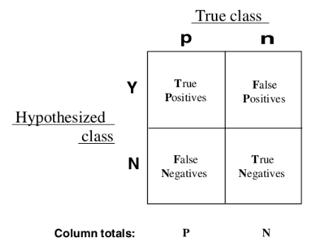

# 准确率，召回率，F值

对于一个组用于测试的样本，其label已知，分类器会将样本分为正负两部分，样本被分割成四个部分。



准确率 $$precision = \frac{TP}{TP+FP}$$

召回率 $$recall = \frac{TP}{TP+FN}$$

F值 $$F-measure = \frac{precision*recall*2}{precision+recall}$$

# ROC曲线与AUC

上面的三个指标，一般是正负样本比例相当，分类阈值取0.5的情况。在很多情况下，正负样本比例是失衡的，阈值取0.5也不合适，随着阈值的变化，三个指标也不同，所以仅仅这三个指标很难评价分类器的效果。


真正率 $$TPR = \frac{TP}{TP+FN}$$ （分类器认为是正样本占真正是正样本的比率）

假正率 $$FPR = \frac{FP}{FP+TN}$$ （分类器认为是正样本占真正是负样本的比率）

在多个阈值下，会得到多组FPR和TPR，以FPR为横坐标，TPR为纵坐标，在坐标系中将多个（FPR，TPR）点链接起来，就是ROC曲线。

而ROC曲线下方的面积就是AUC值，AUC是评价二值分类器的重要指标。

## AUC的计算

### 面积法

将ROC曲线上的每一个折点求出来，再累加下方面积，就是AUC值，sklearn中的auc就是这样计算出来的。

sklearn中求ROC曲线和AUC。

```python
import numpy as np
from sklearn import metrics
y = np.array([1, 1, 1, 2, 2])
pred = np.array([0.1, 0.4, 0.3, 0.4, 0.8])
fpr, tpr, thresholds = metrics.roc_curve(y, pred, pos_label=2)
auc = metrics.auc(fpr, tpr)
```

对其源码进行思路上的分析。

在roc_curve的内部，调用了_binary_clf_curve方法，得到了fps，tps和thresholds。

```python
fps, tps, thresholds = _binary_clf_curve(
      y_true, y_score, pos_label=pos_label, sample_weight=sample_weight)
```

在_binary_clf_curve内部，我排除了weight的处理，只给出了核心代码。

```python
desc_score_indices = np.argsort(y_score, kind="mergesort")[::-1]
y_score = y_score[desc_score_indices]
y_true = y_true[desc_score_indices]
distinct_value_indices = np.where(np.diff(y_score))[0]
threshold_idxs = np.r_[distinct_value_indices, y_true.size - 1]
tps = stable_cumsum(y_true * weight)[threshold_idxs]
fps = 1 + threshold_idxs - tps
```

对y_score进行了归并排序，得到它的下标并反向，的到了从大到小的排列的预测分数的下标。y_score和y_true得到了重排。

distinct_value_indices对相同分数的值进行了去重并去得了下标，threshold_idxs拼接了distinct_value_indices和y_true.size - 1（np.diff是对相邻求差值，np.where在这是得到了非零的下标列表，并拼接了y_true.size - 1）

tps对y_true进行了累加得到了累加列表，并只取了下标在threshold_idxs中的值。

tps是按照阈值从大到小排序并去重后，累加的真正样本数（被分类器判定为正，实际也是正的）。

fps通过tps求出，这个需要理解，tps[i]代表`>=y_score[i]`的正样本数，threshold_idxs[i]代表`>=y_score[i]`的个数减1，fps[i]代表`>=y_score[i]`的负样本数，自然有`fps[i] = 1 + threshold_idxs[i] - tps[i]`

在roc_curve内，结束了_binary_clf_curve的调用，又有另一个优化：

```python
optimal_idxs = np.where(np.r_[True,
                              np.logical_or(np.diff(fps, 2),
                                            np.diff(tps, 2)),
                              True])[0]
fps = fps[optimal_idxs]
tps = tps[optimal_idxs]
thresholds = thresholds[optimal_idxs]
fpr = fps / fps[-1]
tpr = tps / tps[-1]
```

关键要看一下，optimal_idxs这个下标列表是什么。

np.diff(fps, 2)的含义是，np.diff(np.diff(fps)),是对fps进行了两次做差操作，一次做差相当于求导，二次求导，为零说明该点斜率不变，不为零就是拐点。

np.logical_or对fps和tps的拐点进行了合并，的到了一个bool型的列表，并在开头和结尾拼接了两个True。拐点是必要的，但是起始和终止点也不能少啊。

最后，tps[-1]是全部的真正样本数，故`tpr[i] = tps[i] / tps[-1]`，符合真正率定义。fpr同理。

```python
area = direction * np.trapz(y, x)
```

auc函数对输入的点对进行了积分，的到了面积，就是AUC结果了。

这样得到的AUC是无损的，它最大精度的描绘了ROC曲线，并且通过相同阈值去重，非拐点剔除，进行了无损的数据压缩。但存在大量的排序操作，是性能的瓶颈点。

### U Test


### 两种方法的联系

##### 已知

$$n_1$$为正样本总数，$$n_2$$为负样本总数，$$tps_i$$和$$fps_i$$含义同上，有$$tps_0 = fps_0 = 0$$,$$tps_{m-1} = n_1$$,$$fps_{m-1} = n_2$$

$$tpr_i = \frac{tps_i}{n_1}$$ , $$fpr_i = \frac{fps_i}{n_2}$$

$$\sum_{i=1}^m (a[i] - a[i-1]) = a[m-1] - a[0]$$,裂项相消

$$第i份样本排名=其中正样本个数 * 平均rank$$

$$其中正样本个数=tps_i - tps_{i-1}$$

$$平均rank = (最高rank+最低rank)/2 = \frac{(n_1 + n_2 - tps_{i-1} - fps_{i-1})+(n_1 + n_2 - tps_i - fps_i + 1)}{2}$$

##### 面积推导：

$$
Under Roc Area=\sum_{i=1}^{m}(fpr_i-fpr_{i-1}) * \frac{tpr_i+tpr_{i-1}}{2}
$$
$$
=\sum_{i=1}^{m} \frac{fps_i - fps_{i-1}}{n_2} * \frac{tps_i + tps_{i-1}}{2 * n_1}
$$
$$
=\frac{1}{2 n_1 n_2} \sum_{i=1}^{m} (fps_i - fps_{i-1}) * (tps_i + tps_{i-1})
$$
$$
=\frac{1}{2 n_1 n_2} \sum_{i=1}^{m} (fps_i * tps_i - fps_{i-1} * tps_{i-1} + fps_i * tps_{i-1} - tps_i * fps_{i-1})
$$
$$
=\frac{1}{2 n_1 n_2} \sum_{i=1}^{m} (fps_i * tps_i - fps_{i-1} * tps_{i-1}) + \frac{1}{2 n_1 n_2} \sum_{i=1}^{m} (fps_i * tps_{i-1} - tps_i * fps_{i-1})
$$
$$
=\frac{1}{2 n_1 n_2} * (tps_{m-1} * fps_{m-1} - tps_0 * fps_0) + \frac{1}{2 n_1 n_2} \sum_{i=1}^{m} (fps_i * tps_{i-1} - tps_i * fps_{i-1})
$$
$$
=\frac{1}{2 n_1 n_2} * (n_1 * n_2 - 0) + \frac{1}{2 n_1 n_2} \sum_{i=1}^{m} (fps_i * tps_{i-1} - tps_i * fps_{i-1})
$$
$$
=\frac{1}{2} + \frac{1}{2 n_1 n_2} \sum_{i=1}^{m} (fps_i * tps_{i-1} - tps_i * fps_{i-1})
$$

##### U Test推导：

$$
\frac{U}{n_1 n_2} = \frac{R_1 - \frac{n_1 (n_1 + 1)}{2}}{n_1 n_2} = - \frac{n_1+1}{2 n_2} + \frac{1}{n_1 n_2} R_1
$$
$$
= - \frac{n_1+1}{2 n_2} + \frac{1}{n_1 n_2} \sum_{i=1}^m (tps_i - tps_{i-1}) * \frac{(n_1 + n_2 - tps_{i-1} - fps_{i-1})+(n_1 + n_2 - tps_i - fps_i + 1)}{2}
$$
$$
= - \frac{n_1+1}{2 n_2} + \frac{1}{2 n_1 n_2} \sum_{i=1}^m (tps_i - tps_{i-1}) * (2 n_1 + 2 n_2 + 1 - tps_{i-1} - fps_{i-1} - tps_i - fps_i)
$$
$$
= - \frac{n_1+1}{2 n_2} + \frac{2 n_1 + 2 n_2 + 1 }{2 n_1 n_2} \sum_{i=1}^m (tps_i - tps_{i-1})
$$
$$
- \frac{1}{2 n_1 n_2} \sum_{i=1}^m (tps_i - tps_{i-1}) * (tps_{i-1} + fps_{i-1} + tps_i + fps_i)
$$
$$
= \frac{n_1 + 2 n_2}{2 n_2} - \frac{1}{2 n_1 n_2} \sum_{i=1}^m (tps_i - tps_{i-1}) * (tps_{i-1} + fps_{i-1} + tps_i + fps_i)
$$
$$
= \frac{n_1 + 2 n_2}{2 n_2}
$$
$$
- \frac{1}{2 n_1 n_2} \sum_{i=1}^m (tps_i tps_{i-1}+tps_2^2 + tps_i fps_i + tps_i fps_{i-1} - tps_{i-1}^2 - tps_{i-1} tps_i - tps_{i-1} fps_i - tps_{i-1} fps_{i-1})
$$
$$
= \frac{n_1 + 2 n_2}{2 n_2} - \frac{1}{2 n_1 n_2} \sum_{i=1}^m (tps_2^2 - tps_{i-1}^2 + tps_i fps_i - tps_{i-1} fps_{i-1})
$$
$$
- \frac{1}{2 n_1 n_2} \sum_{i=1}^m (tps_i tps_{i-1}  + tps_i fps_{i-1} - tps_{i-1} tps_i - tps_{i-1} fps_i)
$$

$$
= \frac{n_1 + 2 n_2}{2 n_2} - \frac{1}{2 n_1 n_2} (tps_{m-1}^2 - tps_0^2 + tps_{m-1} fps_{m-1} - tps_0 fps_0)
$$
$$
- \frac{1}{2 n_1 n_2} \sum_{i=1}^m (tps_i fps_{i-1} - tps_{i-1} fps_i)
$$

$$
= \frac{n_1 + 2 n_2}{2 n_2} - \frac{1}{2 n_1 n_2} (n_1^2 - 0 + n_1 n_2 - 0)
$$
$$
- \frac{1}{2 n_1 n_2} \sum_{i=1}^m (tps_i fps_{i-1} - tps_{i-1} fps_i)
$$

$$
= \frac{1}{2} - \frac{1}{2 n_1 n_2} \sum_{i=1}^m (tps_i fps_{i-1} - tps_{i-1} fps_i)
$$

##### 等证

$$
Under Roc Area=\frac{U}{n_1 n_2}=\frac{1}{2} + \frac{1}{2 n_1 n_2} \sum_{i=0}^{m} (fps_i * tps_{i-1} - tps_i * fps_{i-1})
$$
