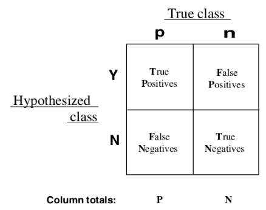

# ROC曲线与AUC

准确率，召回率和F值，一般在正负样本比例相当，分类阈值取0.5的情况，是有效的。

在很多情况下，正负样本比例是失衡的，随着阈值的变化，三个指标也不同，所以仅仅这三个指标很难评价分类器的效果。

一般针对二值分类器，给出测评样本的label和预测得分，可以绘制其ROC曲线。



真正率 $$TPR = \frac{TP}{TP+FN}$$ （分类器认为是正样本占真正是正样本的比率）

假正率 $$FPR = \frac{FP}{FP+TN}$$ （分类器认为是正样本占真正是负样本的比率）

在多个阈值下，会得到多组FPR和TPR，以FPR为横坐标，TPR为纵坐标，在坐标系中将多个（FPR，TPR）点链接起来，就是ROC曲线。

AUC是ROC曲线下方的面积，一般将这个数值作为二值分类器的测评指标。


# AUC的计算

有两种方法计算AUC，下面分析了两种方法的原理和相应实现的开源代码的分析，最后给出了两种方法等价的证明。

## 方法1，面积法

随着阈值不断变小，有三种情况。

正样本数增加1，tpr增加，fpr不变，ROC曲线向上延伸。

负样本数增加1，fpr增加，tpr不变，ROC曲线向右延伸。

有一批样本score相同，正样本增加a1,负样本增加a2,tpr和fpr都增加了，ROC曲线向右上方延伸。

所以，ROC下方面积可以拆分成多个梯形面积之和(前两种情况就是矩形，可按梯形计算)。

将ROC曲线上的每一个折点求出来，再累加下方面积，sklearn中的auc就是这样计算出来的。

### sklearn中求ROC曲线和AUC

```python
import numpy as np
from sklearn import metrics
y = np.array([1, 1, 1, 2, 2])
pred = np.array([0.1, 0.4, 0.3, 0.4, 0.8])
fpr, tpr, thresholds = metrics.roc_curve(y, pred, pos_label=2)
auc = metrics.auc(fpr, tpr)
```

对其源码进行思路上的分析。

在roc_curve的内部，调用了_binary_clf_curve方法，得到了fps，tps和thresholds。

```python
fps, tps, thresholds = _binary_clf_curve(
      y_true, y_score, pos_label=pos_label, sample_weight=sample_weight)
```

在_binary_clf_curve内部，我排除了weight的处理，只给出了核心代码。

```python
desc_score_indices = np.argsort(y_score, kind="mergesort")[::-1]
y_score = y_score[desc_score_indices]
y_true = y_true[desc_score_indices]
distinct_value_indices = np.where(np.diff(y_score))[0]
threshold_idxs = np.r_[distinct_value_indices, y_true.size - 1]
tps = stable_cumsum(y_true * weight)[threshold_idxs]
fps = 1 + threshold_idxs - tps
```

对y_score进行了归并排序，得到它的下标并反向，的到了从大到小的排列的预测分数的下标。y_score和y_true得到了重排。

distinct_value_indices对相同分数的值进行了去重并去得了下标，threshold_idxs拼接了distinct_value_indices和y_true.size - 1（np.diff是对相邻求差值，np.where在这是得到了非零的下标列表，并拼接了y_true.size - 1）

tps对y_true进行了累加得到了累加列表，并只取了下标在threshold_idxs中的值。

tps是按照阈值从大到小排序并去重后，累加的真正样本数（被分类器判定为正，实际也是正的）。

fps通过tps求出，这个需要理解，tps[i]代表`>=y_score[i]`的正样本数，threshold_idxs[i]代表`>=y_score[i]`的个数减1，fps[i]代表`>=y_score[i]`的负样本数，自然有`fps[i] = 1 + threshold_idxs[i] - tps[i]`

在roc_curve内，结束了_binary_clf_curve的调用，又有另一个优化：

```python
optimal_idxs = np.where(np.r_[True,
                              np.logical_or(np.diff(fps, 2),
                                            np.diff(tps, 2)),
                              True])[0]
fps = fps[optimal_idxs]
tps = tps[optimal_idxs]
thresholds = thresholds[optimal_idxs]
fpr = fps / fps[-1]
tpr = tps / tps[-1]
```

关键要看一下，optimal_idxs这个下标列表是什么。

np.diff(fps, 2)的含义是，np.diff(np.diff(fps)),是对fps进行了两次做差操作，一次做差相当于求连线的斜率，二次做差为0说明该点斜率不变，不是一个弯折点。

np.logical_or对fps和tps的拐点进行了合并，的到了一个bool型的列表，并在开头和结尾拼接了两个True。弯折点是必要的，但是起始和终止点也不能少啊。

最后，tps[-1]是全部的真正样本数，故`tpr[i] = tps[i] / tps[-1]`，符合真正率定义。fpr同理。

```python
area = direction * np.trapz(y, x)
```

auc函数对输入的点对进行了积分，的到了面积，就是AUC结果了。

这样得到的AUC是无损的，它最大精度的描绘了ROC曲线，并且通过相同阈值去重，非拐点剔除，进行了无损的数据压缩。但存在大量的排序操作，是性能的瓶颈点。

## 方法2，Mann–Whitney U test

$$U$$为正样本比负样本score大的个数。

根据Mann–Whitney U test的性质，有$$AUC = \frac{U}{n_1 n_2}$$ ,其中$$n_1$$是正样本数，$$n_2$$是负样本数。

$$U$$的计算方法是，将全部样本按score从小到大排序，每个样本会得到一个排名，相同score的排名是它们的平均排名，例如[9,3,3,1]的排名为[4,2.5,2.5,1]，$$R_1 = 正样本排名和$$，$$U = R_1 - \frac{n_1 (n_1 + 1)}{2}$$

### mahout中的AUC计算

```java
//import org.apache.mahout.classifier.evaluation.Auc;
Auc auc = new Auc();
auc.add(0, 0.1);
auc.add(0, 0.4);
auc.add(1, 0.35);
auc.add(1, 0.8);
auc.auc();
```

AUC类内部有两个重要的声明，DoubleArrayList[0]用来存放负样本，DoubleArrayList[1]用来存放正样本，maxBufferSize是其中某一类样本的上限数量。

```java
private int maxBufferSize = 10000;
private final DoubleArrayList[] scores = {new DoubleArrayList(), new DoubleArrayList()};
```

add方法简化后如下，就是取得样本对应的DoubleArrayList对象，如果size已经超过上限，就随机生成一个位置，samples是已经加入的样本总数，位置在buf.size内，就替换掉原先加入的样本score。如果没有超过，就正常加入buf。

```java
public void add(int trueValue, double score) {
  DoubleArrayList buf = scores[trueValue];
  if (buf.size() >= maxBufferSize) {
    int index = rand.nextInt(samples);
    if (index < buf.size()) {
      buf.set(index, score);
    }
  } else {
    buf.add(score);
  }
}
```

解释写在注释中。

```java
public double auc() {
   scores[0].sort();
   scores[1].sort();
   double n0 = scores[0].size();
   double n1 = scores[1].size();
   if (n0 == 0 || n1 == 0) {
     return 0.5;
   }
   int i0 = 0;
   int i1 = 0;
   int rank = 1;//扫描数据过程中，当前处理样本的rank
   double rankSum = 0;//扫描数据过程中，正样本的排名和
   while (i0 < n0 && i1 < n1) {
     double v0 = scores[0].get(i0);
     double v1 = scores[1].get(i1);
     if (v0 < v1) {
       i0++;
       rank++;
     } else if (v1 < v0) {
       i1++;
       //一旦当前比较的正样本小于负样本，正样本的下标就要增加，所以在这累加rank，保证了每个正样本的rank被累加了一次。
       rankSum += rank;
       rank++;
     } else {
       //平均排名的情况
       double tieScore = v0;
       //有多少值相同的负样本
       int k0 = 0;
       while (i0 < n0 && scores[0].get(i0) == tieScore) {
         k0++;
         i0++;
       }
        //有多少值相同的正样本
       int k1 = 0;
       while (i1 < n1 && scores[1].get(i1) == tieScore) {
         k1++;
         i1++;
       }
       //平均排名(rank+k0+k1-1 + rank)/2 = rank + (k0+k1-1)/2,再乘以正样本数
       rankSum += (rank + (k0 + k1 - 1) / 2.0) * k1;
       rank += k0 + k1;
     }
   }
   //如果还有正样本，将它们的排名也累加进去
   if (i1 < n1) {
     rankSum += (rank + (n1 - i1 - 1) / 2.0) * (n1 - i1);
     rank += (int) (n1 - i1);
   }
   //这就是AUC = (rankSum - n1(n1+1)/2) / (n1*n0) = (rankSum / n1 - (n1+1)/2) / n0
   return (rankSum / n1 - (n1 + 1) / 2) / n0;
 }
```

### 等价证明

##### 已知

$$n_1$$为正样本总数，$$n_2$$为负样本总数，$$tps_i$$和$$fps_i$$含义同上，有$$tps_0 = fps_0 = 0$$,$$tps_{m-1} = n_1$$,$$fps_{m-1} = n_2$$

$$tpr_i = \frac{tps_i}{n_1}$$ , $$fpr_i = \frac{fps_i}{n_2}$$

$$\sum_{i=1}^m (a[i] - a[i-1]) = a[m-1] - a[0]$$,裂项相消

$$第i份样本排名=其中正样本个数 * 平均rank$$

$$其中正样本个数=tps_i - tps_{i-1}$$

$$平均rank = (最高rank+最低rank)/2 = \frac{(n_1 + n_2 - tps_{i-1} - fps_{i-1})+(n_1 + n_2 - tps_i - fps_i + 1)}{2}$$

##### 面积推导：

$$
Area Under Curve=\sum_{i=1}^{m}(fpr_i-fpr_{i-1}) * \frac{tpr_i+tpr_{i-1}}{2}
$$
$$
=\sum_{i=1}^{m} \frac{fps_i - fps_{i-1}}{n_2} * \frac{tps_i + tps_{i-1}}{2 * n_1}
$$
$$
=\frac{1}{2 n_1 n_2} \sum_{i=1}^{m} (fps_i - fps_{i-1}) * (tps_i + tps_{i-1})
$$
$$
=\frac{1}{2 n_1 n_2} \sum_{i=1}^{m} (fps_i * tps_i - fps_{i-1} * tps_{i-1} + fps_i * tps_{i-1} - tps_i * fps_{i-1})
$$
$$
=\frac{1}{2 n_1 n_2} \sum_{i=1}^{m} (fps_i * tps_i - fps_{i-1} * tps_{i-1}) + \frac{1}{2 n_1 n_2} \sum_{i=1}^{m} (fps_i * tps_{i-1} - tps_i * fps_{i-1})
$$
$$
=\frac{1}{2 n_1 n_2} * (tps_{m-1} * fps_{m-1} - tps_0 * fps_0) + \frac{1}{2 n_1 n_2} \sum_{i=1}^{m} (fps_i * tps_{i-1} - tps_i * fps_{i-1})
$$
$$
=\frac{1}{2 n_1 n_2} * (n_1 * n_2 - 0) + \frac{1}{2 n_1 n_2} \sum_{i=1}^{m} (fps_i * tps_{i-1} - tps_i * fps_{i-1})
$$
$$
=\frac{1}{2} + \frac{1}{2 n_1 n_2} \sum_{i=1}^{m} (fps_i * tps_{i-1} - tps_i * fps_{i-1})
$$

##### U Test推导：

$$
\frac{U}{n_1 n_2} = \frac{R_1 - \frac{n_1 (n_1 + 1)}{2}}{n_1 n_2} = - \frac{n_1+1}{2 n_2} + \frac{1}{n_1 n_2} R_1
$$
$$
= - \frac{n_1+1}{2 n_2} + \frac{1}{n_1 n_2} \sum_{i=1}^m (tps_i - tps_{i-1}) * \frac{(n_1 + n_2 - tps_{i-1} - fps_{i-1})+(n_1 + n_2 - tps_i - fps_i + 1)}{2}
$$
$$
= - \frac{n_1+1}{2 n_2} + \frac{1}{2 n_1 n_2} \sum_{i=1}^m (tps_i - tps_{i-1}) * (2 n_1 + 2 n_2 + 1 - tps_{i-1} - fps_{i-1} - tps_i - fps_i)
$$
$$
= - \frac{n_1+1}{2 n_2} + \frac{2 n_1 + 2 n_2 + 1 }{2 n_1 n_2} \sum_{i=1}^m (tps_i - tps_{i-1})
$$
$$
- \frac{1}{2 n_1 n_2} \sum_{i=1}^m (tps_i - tps_{i-1}) * (tps_{i-1} + fps_{i-1} + tps_i + fps_i)
$$
$$
= \frac{n_1 + 2 n_2}{2 n_2} - \frac{1}{2 n_1 n_2} \sum_{i=1}^m (tps_i - tps_{i-1}) * (tps_{i-1} + fps_{i-1} + tps_i + fps_i)
$$
$$
= \frac{n_1 + 2 n_2}{2 n_2}
$$
$$
- \frac{1}{2 n_1 n_2} \sum_{i=1}^m (tps_i tps_{i-1}+tps_2^2 + tps_i fps_i + tps_i fps_{i-1} - tps_{i-1}^2 - tps_{i-1} tps_i - tps_{i-1} fps_i - tps_{i-1} fps_{i-1})
$$
$$
= \frac{n_1 + 2 n_2}{2 n_2} - \frac{1}{2 n_1 n_2} \sum_{i=1}^m (tps_2^2 - tps_{i-1}^2 + tps_i fps_i - tps_{i-1} fps_{i-1})
$$
$$
- \frac{1}{2 n_1 n_2} \sum_{i=1}^m (tps_i tps_{i-1}  + tps_i fps_{i-1} - tps_{i-1} tps_i - tps_{i-1} fps_i)
$$

$$
= \frac{n_1 + 2 n_2}{2 n_2} - \frac{1}{2 n_1 n_2} (tps_{m-1}^2 - tps_0^2 + tps_{m-1} fps_{m-1} - tps_0 fps_0)
$$
$$
- \frac{1}{2 n_1 n_2} \sum_{i=1}^m (tps_i fps_{i-1} - tps_{i-1} fps_i)
$$

$$
= \frac{n_1 + 2 n_2}{2 n_2} - \frac{1}{2 n_1 n_2} (n_1^2 - 0 + n_1 n_2 - 0)
$$
$$
- \frac{1}{2 n_1 n_2} \sum_{i=1}^m (tps_i fps_{i-1} - tps_{i-1} fps_i)
$$

$$
= \frac{1}{2} - \frac{1}{2 n_1 n_2} \sum_{i=1}^m (tps_i fps_{i-1} - tps_{i-1} fps_i)
$$

##### 等证

$$
Area Under Curve=\frac{U}{n_1 n_2}=\frac{1}{2} + \frac{1}{2 n_1 n_2} \sum_{i=0}^{m} (fps_i * tps_{i-1} - tps_i * fps_{i-1})
$$
